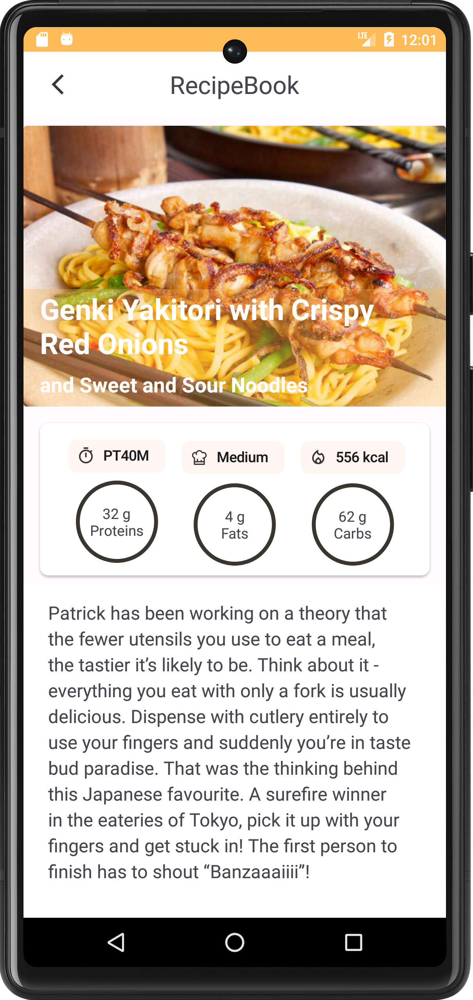
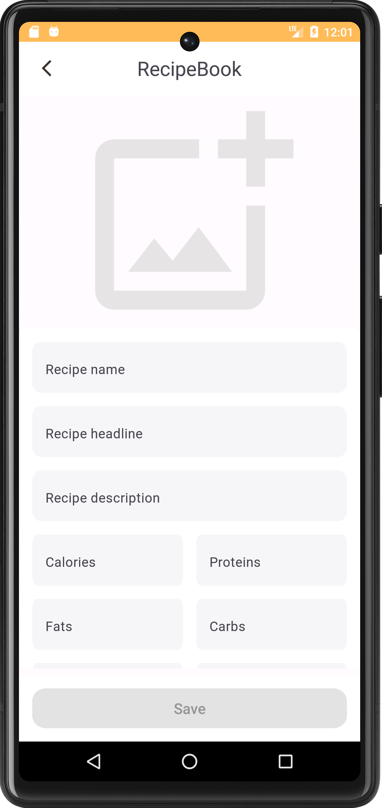
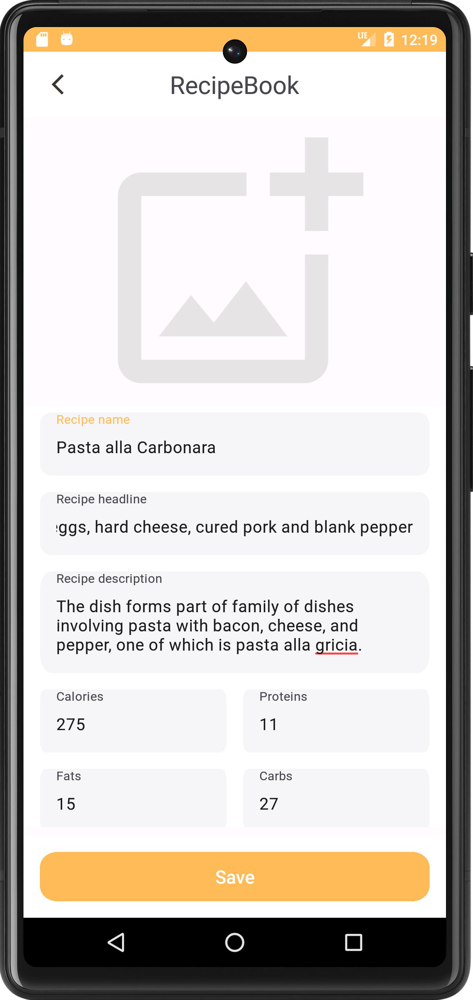
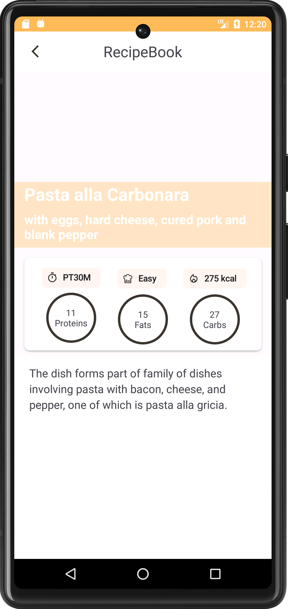

# RecipeBook

### Тестовое задание на позицию Android Developer / Android-разработчик.

#### Стек:

Проект реализован с применением подхода Clean Architecture и MVVM+UDF. 

- Kotlin
- AdapterDelegates
- Clean Architecture
- MVVM + UDF
- Data / View binding
- Coroutine
- Koin
- Room
- Retrofit
- Gson

#### Приложение - книга рецептов.

  Приложение позволяет загрузить имеющиеся рецепты с сервера, посмотреть детальную информацию о каждом рецепте, а также добавлять свои рецепты.

  
    
    
    
    
    

#### Backlog.

- Реализовать добавление фото в пользовательские рецепты.
- Добавить DiffUtils в RcyclerView.

